# Bonus challenges: notes

## Marketplace conversions

### What was getting in the way

Funnel: grid → listing → booking.

| Step   | Friction observed                                                                                  | Why it matters                                                                                            |
| ------ | -------------------------------------------------------------------------------------------------- | --------------------------------------------------------------------------------------------------------- |
| Grid   | Cards showed name, type and price only. Nothing about the audience.                                | A price means nothing without reach. Sponsors can't tell a good deal from a bad one, so they don't click. |
| Grid   | No search, filter or sort; 20 slots in one unordered list; booked slots mixed in.                  | Browsing costs effort; unavailable inventory wastes clicks.                                               |
| Grid   | None of the theme colors rendered (Tailwind v3 syntax on v4), so primary CTAs were white-on-white. | Buttons that don't look like buttons don't get clicked.                                                   |
| Detail | Signed-out visitors got a **disabled** grey button.                                                | A dead end at the highest-intent moment, with no way forward.                                             |
| Detail | No audience data, no trust signals, no "what happens next".                                        | Unanswered objections ("is this audience real?", "am I charged now?") stall the decision.                 |
| Detail | Booked slots showed only "Currently booked" plus a "Reset listing" link anyone could press.        | High-intent demand for popular inventory was thrown away, and anyone could un-book anyone.                |
| Detail | Direct booking was the only path.                                                                  | Buyers who need custom terms or a quote for approval had nowhere to go.                                   |

### What changed

- **Cards answer "is it worth it?"**: monthly reach and an **effective CPM** (price per 1,000 monthly views) on every card and listing. CPM makes a $150 blog footer comparable to a $5,000 video integration. Verified publishers get a badge.
- **Findability**: search (name, description, publisher), format filter, "available only", sort (featured / price / newest), and pagination, all in the URL so results are shareable and server-rendered. "Featured" puts available inventory first.
- **No dead ends**: signed-out visitors see "Log in to book" instead of a disabled button. Booked slots and publishers-who-aren't-sponsors still have a path: **Request a quote**.
- **Objection handling on the detail page**: an audience facts grid, an about-the-publisher section, and a 3-step "How booking works" that states nothing is charged at booking.
- **Sticky booking panel** on desktop, so the CTA stays in view while reading.
- **Clear outcome**: the success state says what happens next instead of offering a test-only reset link.

### How I'd measure it

The analytics events (below) map directly onto the funnel:

- Grid CTR = `select_item` / `view_item_list`
- Detail → start = `begin_checkout` / `view_item`
- Start → booked = `purchase` / `begin_checkout`
- Lead capture = `generate_lead` (quotes) and `sign_up` (newsletter) per `view_item`

Primary metric: **bookings per marketplace visitor**. Guardrail: quote requests shouldn't cannibalise direct bookings on available slots (compare `generate_lead` share on available vs booked listings). Changes like the CPM display should ship behind the A/B framework rather than all at once, so each one's lift is attributable.

## Google Analytics + conversion tracking

- `@next/third-parties/google` loads GA4 only when `NEXT_PUBLIC_GA_ID` is set. Without it, `track()` logs to the console in development so the events are easy to verify (`[analytics] view_item {...}`).
- `lib/analytics.ts` exposes one typed `track(event, params)`. Event names follow GA4's recommended ecommerce/lead names so standard reports work without custom setup.
- Server Components can't run effects, so `<TrackEvent>` fires view events on mount (deduped against StrictMode's dev double-invoke, and it re-fires when the filters change). `<TrackedLink>` records clicks before client navigation.
- **Every event carries `user_type`** (`sponsor` / `publisher` / `guest`), also set as a GA4 user property, so each funnel can be split by who is browsing. The root layout sets it once, before any page-level event fires.
- **CTA clicks are micro-conversions** (`cta_click` with a `cta` name): landing hero and final CTAs, "Log in to book", and opening "Request a quote".
- Conversions fire **after the server confirms** (inside the action wrapper), never optimistically, and carry the item id, value and A/B variant.

## A/B testing

- `lib/experiments.ts` declares experiments with weighted variants. Two run concurrently:
  - `booking-cta`: `control` "Book this placement" vs `outcome` "Reserve your spot" (read in a Server Component with `getVariant()`)
  - `quote-cta`: `control` "Request a quote" vs `pricing` "Get custom pricing" (read in a Client Component with `useABTest()`)
- `proxy.ts` assigns the variant **before rendering** and persists it in a cookie for a year. The Server Component reads it with `getVariant()`, so there's no flicker and crawlers see real HTML.
- Exposure (`experiment_exposure`) fires only when the CTA is actually shown (available slot, sponsor viewer); `begin_checkout` and `purchase` carry `cta_variant` for per-variant conversion rates.
- **Verify**: two browsers (or one incognito) get independent sticky variants; clear cookies to re-roll; force one with `/marketplace/<id>?ab_booking-cta=outcome`.
- **Client Components** use `useABTest('<id>')`. The layout passes the server-read assignments through context, so client-rendered variants are in the server HTML too, with no flicker or hydration mismatch.
- **Add a test**: add an entry to `EXPERIMENTS`, then call `getVariant('<id>')` (server) or `useABTest('<id>')` (client).

## Other bonuses

- **Newsletter**: footer form on every page, `POST /api/newsletter/subscribe` (zod-validated, not persisted, per the brief), success state, inline errors, input kept on error.
- **Request a quote**: dialog on every listing (including booked ones), prefilled email for signed-in users, `POST /api/quotes/request` returning a `quoteId`, confirmation with a reference number and expected response time.
- **Landing page**: hero, live platform stats and featured listings from the API (each degrades independently if the API is down), benefits for both sides, how it works, final CTA. Metadata template, Open Graph/Twitter cards, a generated OG image, JSON-LD, robots.txt, favicon.
- **Dashboard UI**: summary stat tiles, status badges, budget progress bars, empty states with a CTA, dialog forms, toast feedback, inline two-step delete.
- **Animations**: fade-in cards, hover lift, button press, animated focus rings, dialogs and bottom sheets that slide in, toasts that slide in and out, cards that fade while their delete is in flight, and a spinner in pending buttons. All CSS, no animation library, and all disabled under `prefers-reduced-motion`.
- **Mobile**: `
` hamburger menu (works before JS loads), dialogs become bottom sheets, 44px touch targets, 16px inputs (no iOS zoom), `inputMode` on numeric fields.
- **Error / empty / loading states**: skeleton `loading.tsx` per section (including one matching the listing detail layout), `error.tsx` with retry, `not-found.tsx`, context-aware empty states ("Nothing matches those filters" + Clear filters).
- **ESLint**: zero errors and zero warnings (after repairing the lint toolchain itself, which couldn't run at all). `apps/backend/src/utils/helpers.ts` was deleted rather than fixed: nothing imported it.
- **Pagination**: server-side, windowed page numbers with gaps, prev/next, "Showing X–Y of Z", and a jump-to-page form (a plain GET, so it works without JS).
- **Dark mode**: follows the OS setting; every color is a token, so there are no hardcoded light-only colors.

## Ideas I deliberately didn't build

The bonus briefs list ideas, not requirements. These were left out on purpose:

- **Urgency messaging** ("only 2 left!"): the data has no real scarcity signal, and invented urgency erodes the trust the listing pages work to build. "Available now" is the honest version.
- **Confirmation modal for deletes**: an inline two-step confirm keeps the context in view and is one click fewer than a modal for a yes/no decision.
- **Dashboard filter/sort and grid/list toggle**: the demo accounts have a handful of items each; revisit when real accounts have dozens.
- **Bottom navigation, swipe and pull-to-refresh**: the app has only two or three destinations per role, so a `
` menu covers it without custom gesture handling.
- **Dismissible newsletter form**: it sits in the footer, not in a popup, so there's nothing to dismiss.
- **Quote attachments and company prefill**: attachments need storage, and the sponsor record doesn't reliably hold a company name. The email is prefilled.
- **Testimonials**: there are none to show, and fabricated ones would be worse than none. The landing page uses live platform numbers and real listings as social proof instead.

## Screenshots

Captured with Playwright against the seeded demo data.

| | |
| --- | --- |
| 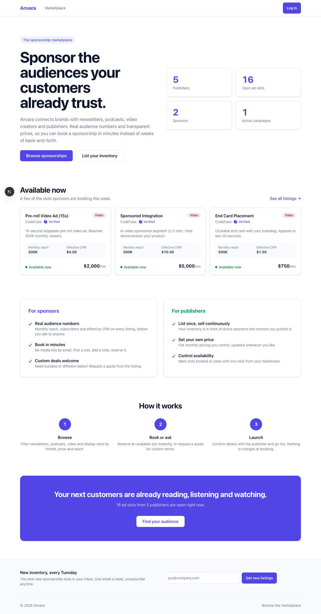 Landing | 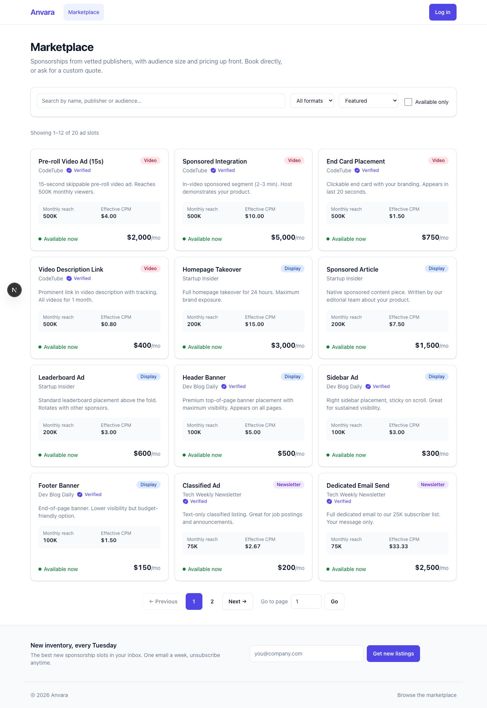 Marketplace with filters and pagination |
| 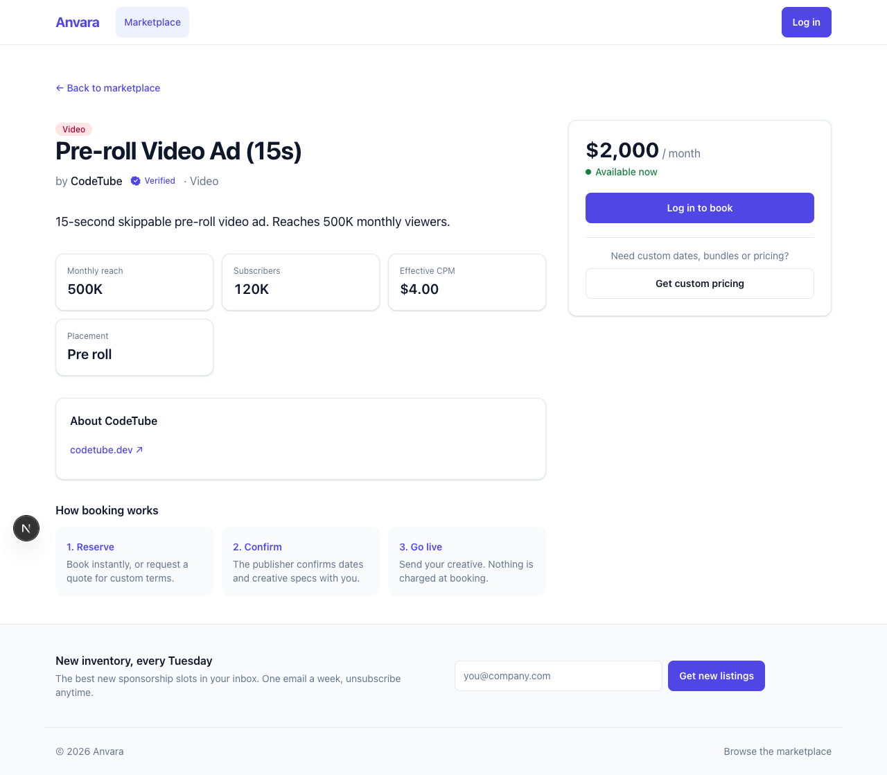 Listing, signed out: "Log in to book" | 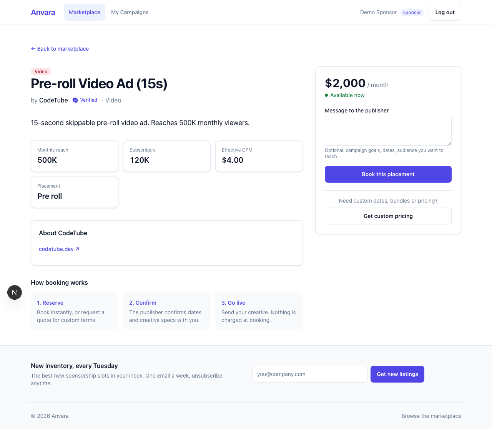 Listing as a sponsor |
| 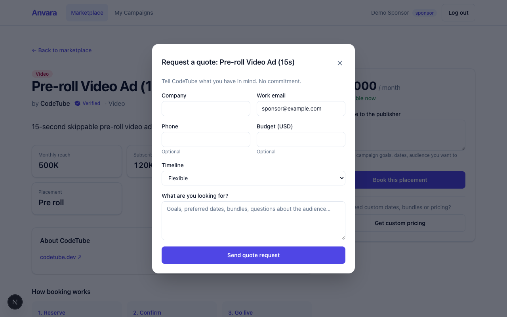 Request a quote | 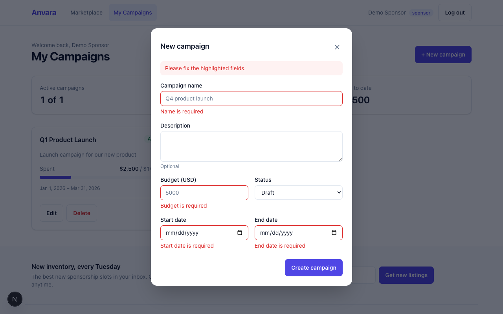 Field-level validation |
| 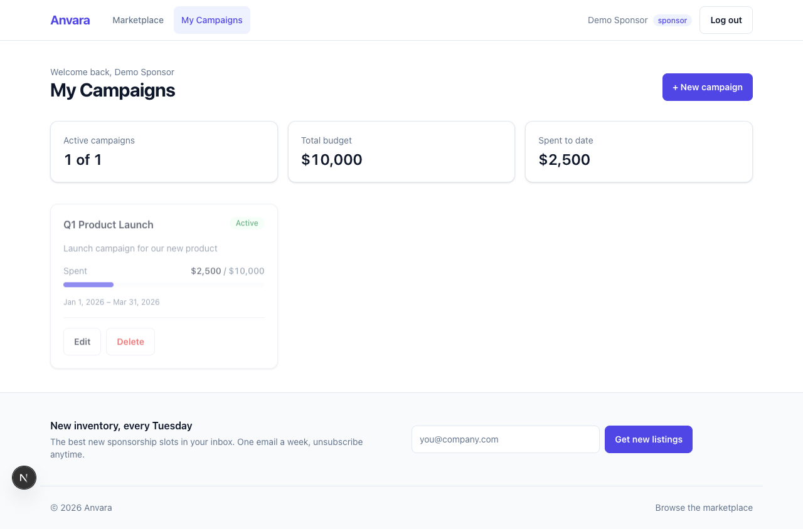 Sponsor dashboard | 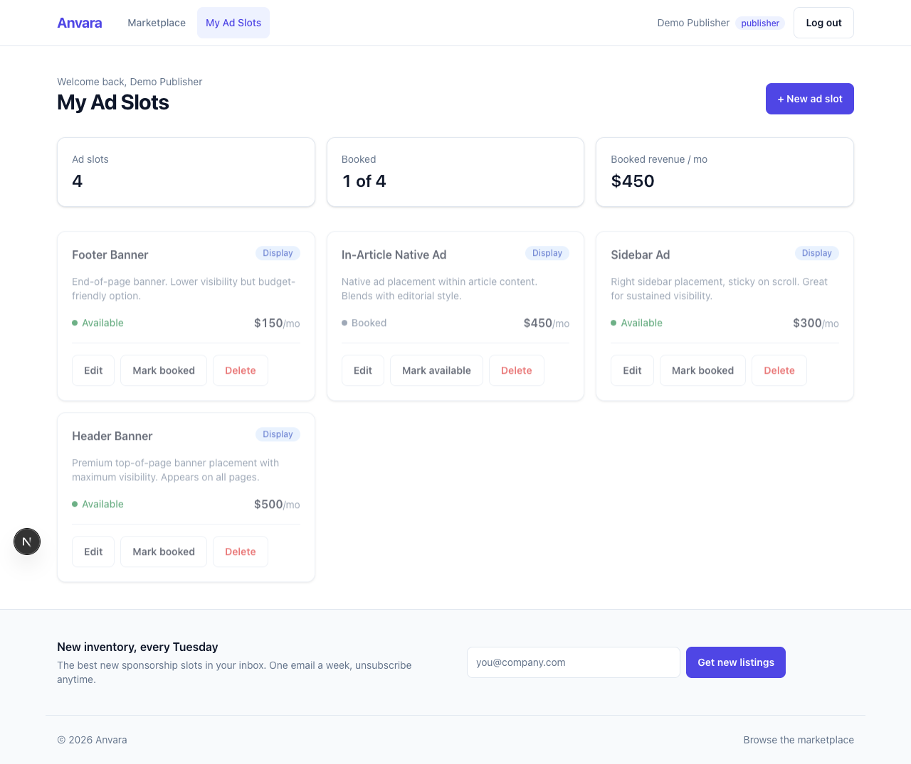 Publisher dashboard |
| 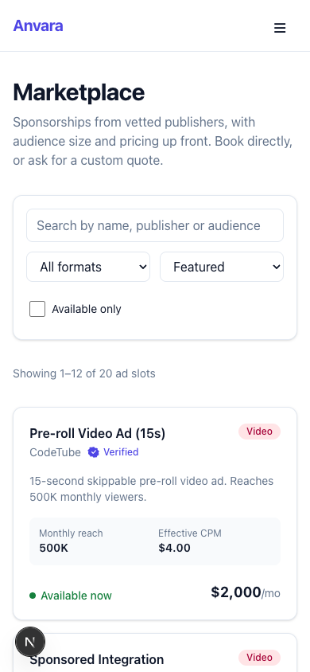 Mobile | 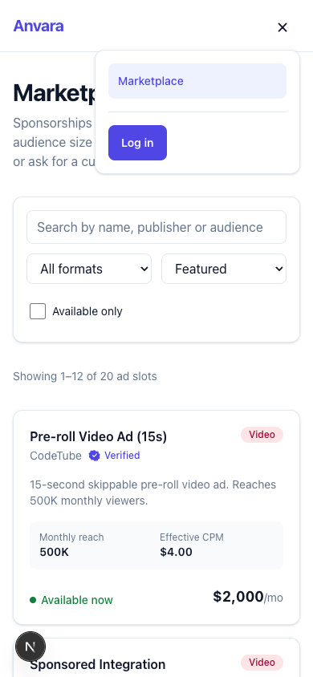 Mobile menu |
| 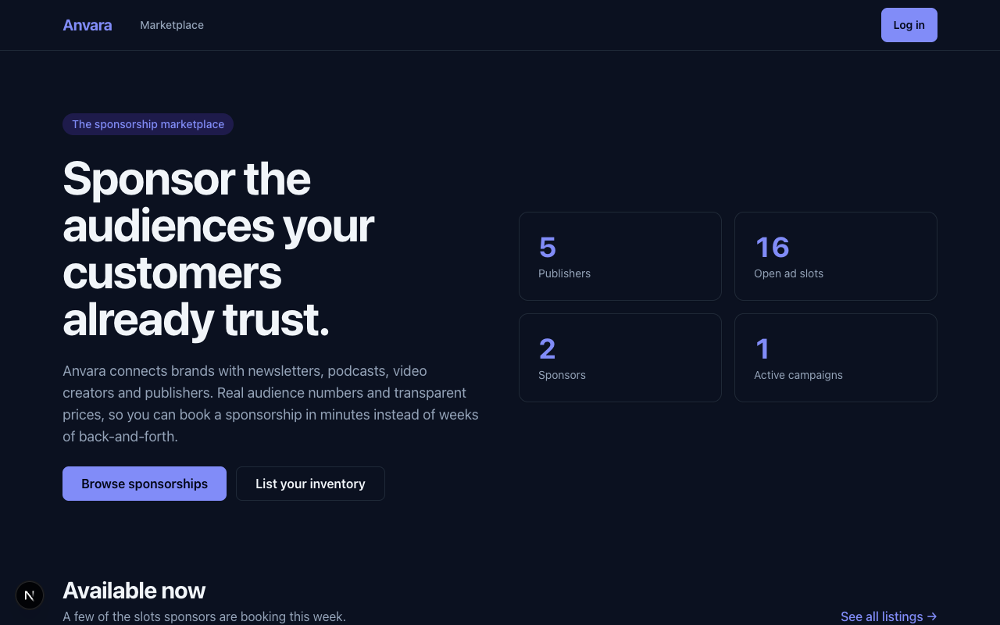 Dark mode | |
